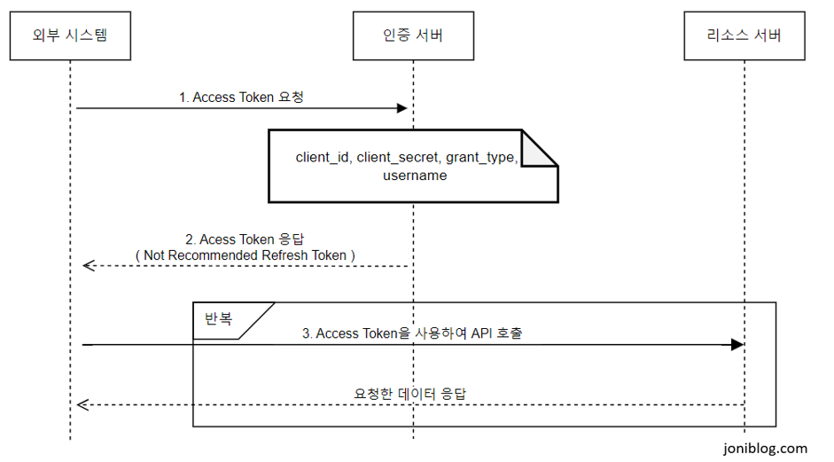

## 서론

최근 회사내 인증 서버를 구축하여 프로젝트 진행 과정동안 공부한 내용을 정리했습니다. 이 프로젝트의 주요 목표는 OAuth 2.0, OpenID Connect를 활용하여 API서버간 안전하고 확장 가능한 인증 시스템을 만드는 것입니다. 이 글에서는 OAuth 2.0과 OpenID Connect의 개념, 그리고 OpenIddict 적용 방법에 대해 공부하고 정리한 내용을 포스팅하겠습니다.

## 인증 방식 프로세스

- 사전에 개별 제공된 인증 정보로서 인증 서버를 통해 인증을 거쳐야 한다.
- 인증 성공 시 인증 서버로 부터 발급 받은 Access Token을 API 서버 연동 호출 시에 HTTP 헤더에 포함시킨다.
- API 서버는 외부 API 서버로 전달 받은 토큰 정보를 이용하여 토큰의 적합성 검사를 진행 한 후 토큰이 정상일 경우 API를 호출하여 그 Response를 외부 API 서버에 반환 한다.

## 인증서버 구축의 주요 목표

- 보안 강화
- 규제 준수
- 확장성과 유연성
- 중앙 집중식 사용자(외부서버) 관리

## 다음

[OAuth 2.0에 대하여](../oauth-2.0/index.md) OAuth 2.0과 OpenID Connect의 개념정리