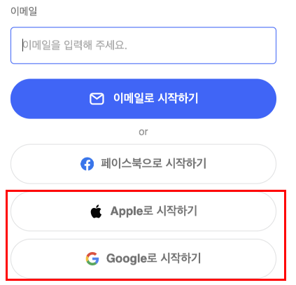
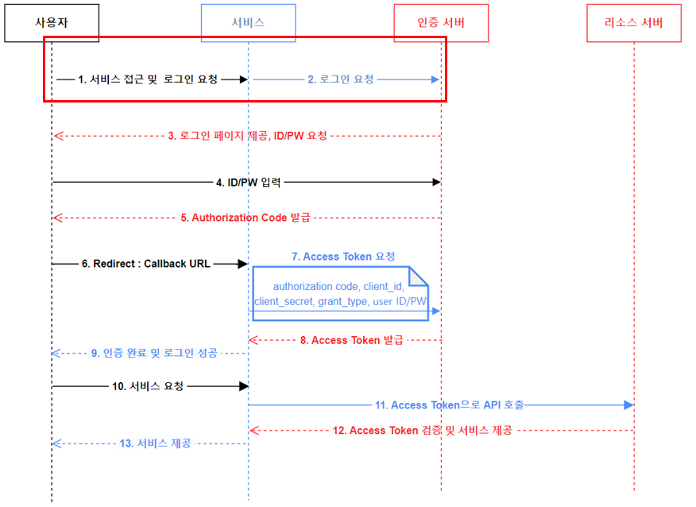
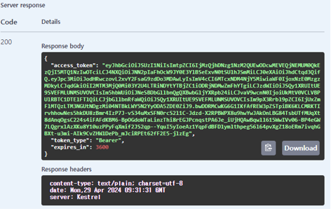
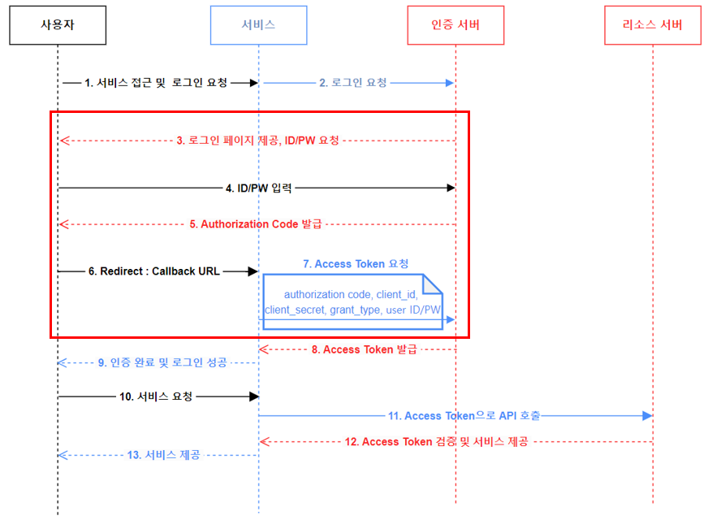
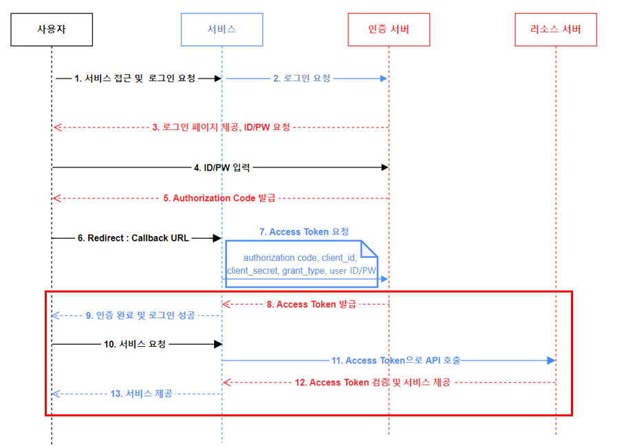

## 서론

이번 글에서는 OAuth2.0에 대해서 알아보고 이것을 어떻게 적용하여 서버를 구성하는지 살펴 보겠습니다.
실제로 실무에서 인증서버 OAuth2.0 적용하여 구성하였고 구성하는동안 공부 및 정리한 내용을 다루겠습니다.


## OAuth 2.0란?


OAuth 서버는 인증서버로부터 인증된 클라이언트만 접근 하도록 할 수 있으며, 추가로 클라이언트 별로 권한을 부여 하여 권한 별로 처리 할 수 있도록 할 수 있다. 

다양한 서비스(웹서비스, 모바일앱, IOT기기등등) 이런 다양한 환경에서도 당연하게 로그인, 사용자 인증과 같은 절차는 필수적으로 이루어진다. 이렇게 다양한 환경을 모두 아우를 수 있도록 사용자 인증 절차를 표준화한 것이 OAuth이다.
> 접근 권한을 위임(Delegated Authorization)받을 수 있는 표준 프로토콜

예를 들어 페이스북, 카카오톡 개발자 센터에 가보면 로그인 기능의 경우 OAuth 2.0 형태로 되어있으며, 내 앱에 페이스북, 카카오톡 로그인을 붙여 사용자 정보를 가져와서 SNS 로그인 기능을 구현할 수 있으며, 로그인 한 사용자의 페이스북, 카카오톡을 컨트롤 할 수 있다.

> OAuth 2.0은 1.0에서 알려진 보안 문제 등을 개선한 버젼이다.
   
그리고 OAuth2는 이름에서도 알 수 있듯이 OAuth의 2번째 버전이고, 현재는 OAuth2가 RFC 표준으로 등록되어서 사용되고 있다.
OAuth2는 기본적으로 아래의 흐름을 갖고 있다.

## OAuth 2.0 용어 정리

|구분|설명|
|-|---|
|**Resource Server**| Client의 액세스 토큰을 검증하여 요청을 처리한다.<br/>(ex - Google, Naver, Kakao ...) <br/><br/>클라이언트(Client) - 이 서버로 인증 서버에서 발급받은 Token을 넘겨 검증을 한다.|
|**Authorization Server**| Client를 인증하고, Client에게 액세스 토큰을 발급또는 권한 부여를 담당한다.|
|**Access Token**|API 통신에 대한 접근 권한을 Resource Owner가인가하였음을 나타내는 자격증명이다.|
|**Refresh Token**|access token은 보안상 만료기간이 짧기 때문에 얼마 지나지 않아 만료되면 사용자는 로그인을 다시 시도해야한다. 그러나 refresh token이 있다면 access token이 만료될 때 refresh token을 통해 access token을 재발급 받아 재 로그인 할 필요없게끔 한다.|
|**Grant Type**|**허가를 받는 유형**애플리케이션이 사용자 데이터를 안전하게 액세스하도록 돕는 방식. 주요 유형으로는 웹 애플리케이션에 적합한 **Authorization Code Grant (권한 부여 코드 유형)**, Client 사이드 애플리케이션에 적합한 **Implicit Grant (암시적 유형)**, 신뢰할 수 있는 애플리케이션에서 사용하는 **Password Grant**, 서버 간 통신을 위한 **Client Credentials Grant (Client 자격 증명 유형)**, 만료된 토큰 갱신을 위한 **Refresh Token Grant (갱신 토큰 유형)** 이 있다.|
| **Scope**| 클라이언트가 요청하는 권한의 범위를 정의하여, 액세스 토큰이 어떤 자원과 작업에 접근할 수 있는지 명시한다. 구글로 로그인을 했다면, 그 서비스 안에서 사용할 수 있는 모든 기능 |
|**Authorized redirect URIs**| 예를 들어, 사용자가 "특정 사이트"에 로그인하려고 할 때, 구글 로그인을 선택하면 구글 로그인 페이지로 이동하고 로그인이 끝나면, 구글은 사용자를 다시 "특정 사이트"로 돌려보냅니다. 이때 사용자를 돌려보낼 주소이다.
|**Client ID**| Client를 식별하는 식별자 ID를 의미 한다.
|**Client Secret**| Client ID에 해당한 PASSWORD 이다.


##  OAuth 2.0 인증 과정

아래 이미지는 주로 소셜 로그인에 사용되고 있는 `Authorization Code Grant (권한 부여 코드 유형)`을 적용시킨 `OAuth 2.0 인증 과정 프로세스 예시`입니다.


* **서비스(사용자가 이용하려는 서비스) - Client**
* **인증 서버 - Authorization Server**

크게 요약해보면,

Client(사용자가 이용하려는 서비스)에서 서비스를 이용하려는 사용자를 대신하여 Authorization Server와 Resource Server에 요청을 보내 필요한 정보를 서로 비교해 유효성을 판단한다.

##  인증 과정 자세히 
### 1. 사용자는 서비스를 이용하기 위해 로그인 화면에 접근 한다.
### 2. 그럼 서비스는 사용자에게 로그인 페이지를 제공하게된다. 로그인 페이지에서 사용자는 "소셜 로그인"을 시도한다.




Client 서버는 OAuth 프로세스를 시작하기 위해 사용자의 브라우저를 Authorization Server로 보내야한다.

Client 서버는 이때 Authorization Server가 제공하는 Authorization URL에 `response_type` , `client_id` , `redirect_uri` , `scope` 등의 매개변수를 포함하여 보낸다.

```
https://accounts.google.com/o/oauth2/auth?
&response_type=code
&client_id=1234567890-abcde
&redirect_uri=https://yourapp.com/callback
&scope=email,profile
```
### 3. Authorization URL로 이동된 사용자는 제공된 로그인 페이지에
### 4. ID/PW 입력하여 인증 시도 
### 5. Authorization Code 발급하고,
### 6. Redirect URI로 Redirect
```
https://yourapp.com/callback?code=AUTHORIZATION_CODE
```

인증이 성공되었다면, Authorization Server는 제공된 Redirect URI로 사용자를 리다이렉션시킬 것 이다. 이때, Redirect URI에 Authorization Code를 포함하여 사용자를 리디렉션 시킨다.

이때, Authorization Code란 Client가 Access Token을 획득하기 위해 사용하는 임시 코드이며 Authorization Code Grant 타입 인증방식의 주요 포인트다.

### 7. Client 서버는 Authorization Server에 Authorization Code를 전달하고, Access Token을 응답 

Client는 발급받은 사용자가 쿠키나 세션에 Access Token을 저장하고, 이후 Resource Server에서 사용자가 리소스서버에 접근하기 위해 Access Token을 같이 전달하게 된다.

당연히 `Access Token`은 유출되어서는 안되고 제 3자가 가로채지 못하도록 HTTPS 연결을 통해서만 사용될 수 있다. 아래는 ASP.NET Core 애플리케이션에서 OpenID Connect와 OAuth 2.0 인증 및 인가를 구현하기 위한 라이브러리 프레임워크 `Openiddict`로 적용한 프로젝트에 `HTTP`로 통신했을때 나왔던 에러다.
```
{
  "error": "invalid_request",
  "error_description": "This server only accepts HTTPS requests.",
  "error_uri": "https://documentation.openiddict.com/errors/ID2083"
}
```

토큰 발급 성공 예시


Authorization Code와 Access Token 교환은 `token` 엔드포인트에서 이루어진다. 아래는 token 엔드포인트에서 Access Token을 발급받기 위한 HTTP 요청의 예시이다. 이 요청은 `application/x-www-form-urlencoded` 의 형식에 맞춰 필수 매개변수를 전달해야한다.

```
POST https://oauth2.googleapis.com/token
Content-Type: application/x-www-form-urlencoded

client_id=YOUR_CLIENT_ID&
client_secret=YOUR_CLIENT_SECRET&
code=AUTHORIZATION_CODE&
redirect_uri=YOUR_REDIRECT_URI&
grant_type=authorization_code
```

- `grant_type` : Authorization Code Grant에 맞는 `authorization_code` 로 설정 
- `code` : 발급받은 Authorization Code
- `redirect_uri` : Redirect URI
- `client_id` : Client ID
- `client_secret` : Client ID에 해당하는 Client Secret이 발급된 경우 포함하여 요청해야한다.




### 8 ~ 9. 인증 완료 및 로그인 성공

위 과정을 성공적으로 마치면 Client 서버는 사용자에게 로그인이 성공하였음을 알린다.


### 10 ~ 13. Access Token으로 리소스 접근

이후 사용자가 Resource Server의 리소스가 필요한 기능을 Client 서버에 요청한다. Client 서버는 위 과정에서 발급받고 저장해둔 사용자의 Access Token을 사용하여 리소스 서버에 토큰을 검증하고, 사용자가 Clien 서버에 요청한 정보를 제공한다.




아래 이미지는 **Client Credentials Grant Type**을 적용시킨 OAuth 2.0 인증과정 프로세스 예시입니다.


프로젝트에선 Authorization Code Grant 형식을 적용하진 않았지만 인증서버 구축 전 일반적 사용되는 소셜 로그인을 분석하고 공부한 내용을 정리하겠습니다.