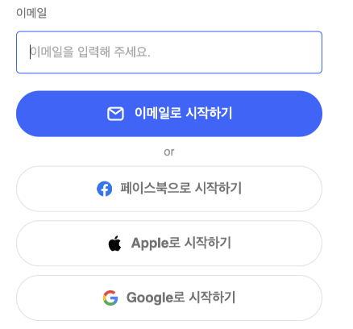
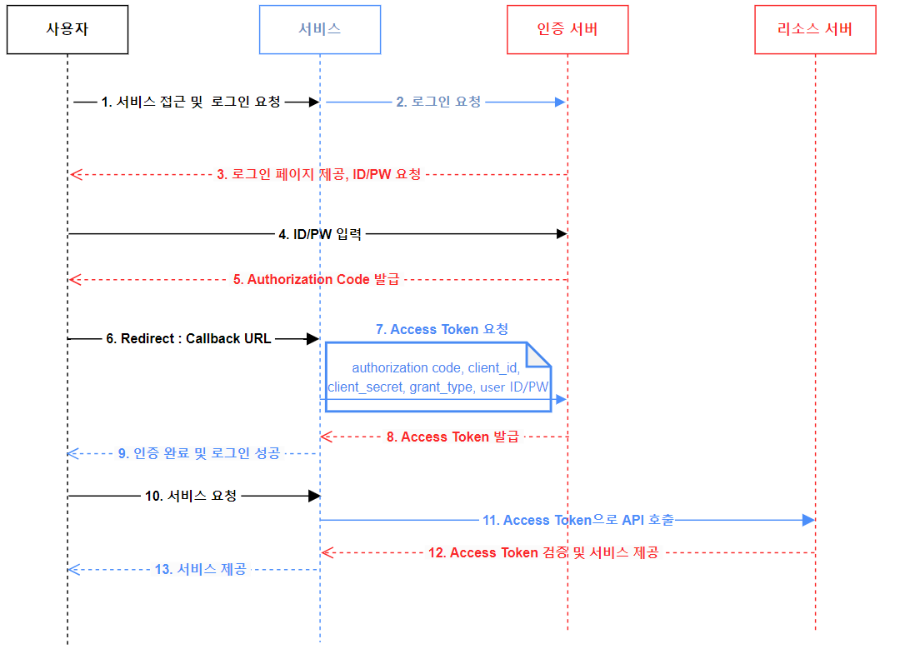
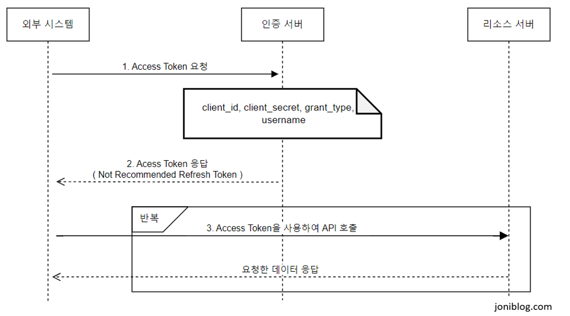

## 서론

이번 글에서는 OAuth2.0에 대해서 알아보고 이것을 어떻게 적용하여 서버를 구성하는지 살펴 보겠습니다.
실제로 실무에서 인증서버 OAuth2.0 적용하여 구성하였고 구성하는동안 공부 및 정리한 내용을 다루겠습니다.

## OAuth 2.0란?

OAuth 서버는 인증서버로부터 인증된 클라이언트만 접근 하도록 할 수 있으며, 추가로 클라이언트 별로 권한을 부여 하여 권한 별로 처리 할 수 있도록 할 수 있다. 

다양한 서비스(웹서비스, 모바일앱, IOT기기등등) 이런 다양한 환경에서도 당연하게 로그인, 사용자 인증과 같은 절차는 필수적으로 이루어진다. 이렇게 다양한 환경을 모두 아우를 수 있도록 사용자 인증 절차를 표준화한 것이 OAuth이다.
> 접근 권한을 위임(Delegated Authorization)받을 수 있는 표준 프로토콜

예를 들어 페이스북, 카카오톡 개발자 센터에 가보면 로그인 기능의 경우 OAuth 2.0 형태로 되어있으며, 내 앱에 페이스북, 카카오톡 로그인을 붙여 사용자 정보를 가져와서 SNS 로그인 기능을 구현할 수 있으며, 로그인 한 사용자의 페이스북, 카카오톡을 컨트롤 할 수 있다.

> OAuth 2.0은 1.0에서 알려진 보안 문제 등을 개선한 버젼이다.
   
그리고 OAuth2는 이름에서도 알 수 있듯이 OAuth의 2번째 버전이고, 현재는 OAuth2가 RFC 표준으로 등록되어서 사용되고 있다.
OAuth2는 기본적으로 아래의 흐름을 갖고 있다.

## OAuth 2.0 용어 정리

|구분|설명|
|-|---|
|**Resource Server**|클라이언트의 액세스 토큰을 검증하여 요청을 처리한다. (ex - Google, Naver, Kakao ...)   클라이언트(Client) - 이 서버로 인증 서버에서 발급받은 Token을 넘겨 개인 정보를 받을 수 있다.|
|**Authorization Server**| 클라이언트를 인증하고, 클라이언트에게 액세스 토큰을 발급또는 권한 부여를 담당한다.|
|**Access Token**|API 통신에 대한 접근 권한을 Resource Owner가인가하였음을 나타내는 자격증명이다.|
|**Refresh Token**|access token은 보안상 만료기간이 짧기 때문에 얼마 지나지 않아 만료되면 사용자는 로그인을 다시 시도해야한다. 그러나 refresh token이 있다면 access token이 만료될 때 refresh token을 통해 access token을 재발급 받아 재 로그인 할 필요없게끔 한다.|
|**Grant Type**|**허가를 받는 유형**애플리케이션이 사용자 데이터를 안전하게 액세스하도록 돕는 방식. 주요 유형으로는 웹 애플리케이션에 적합한 **Authorization Code Grant (권한 부여 코드 유형)**, 클라이언트 사이드 애플리케이션에 적합한 **Implicit Grant (암시적 유형)**, 신뢰할 수 있는 애플리케이션에서 사용하는 **Password Grant**, 서버 간 통신을 위한 **Client Credentials Grant (클라이언트 자격 증명 유형)**, 만료된 토큰 갱신을 위한 **Refresh Token Grant (갱신 토큰 유형)** 이 있다.|
| **Scope**| 클라이언트가 요청하는 권한의 범위를 정의하여, 액세스 토큰이 어떤 자원과 작업에 접근할 수 있는지 명시한다. |

##  OAuth 2.0 인증 과정

아래 이미지는 주로 소셜 로그인에 사용되고 있는 **Authorization Code Grant (권한 부여 코드 유형)**을 적용시킨 OAuth 2.0 인증 과정 프로세스 예시입니다.

아래 이미지는 **Client Credentials Grant Type**을 적용시킨 OAuth 2.0 인증과정 프로세스 예시입니다.

## 다음

<!-- [OAuth 2.0과 OpenID Connect에 대하여](/quick-start-kr) OAuth 2.0과 OpenID Connect의 개념정리 -->