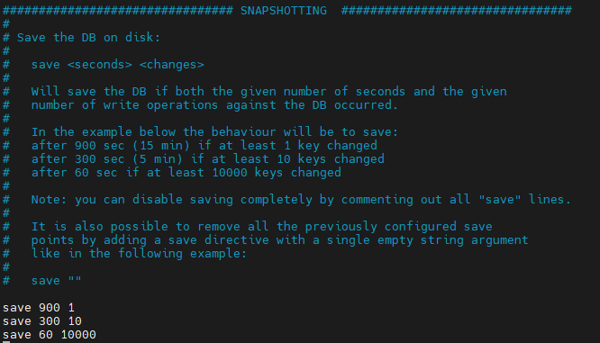

## 저장 방식 단점 보완을 위한 Persist Option 

 메모리 기반이지만 Redis는 영속적인 데이터 보존(Persistence)이 가능하다. (메모리는 원래 휘발성) 기존 데이터를 영속화하여 복구, 유지시키기 위해서는 디스크에 데이터 백업해주는 과정이 필요하다. 

백업 방식에는 1) RDB snapshot, 2) AOF 2가지가 있다.
> 여기서 `RDB`는 Redis DataBase를 의미한다.


### RDB snapshot 방식


특정 시점을 스냅샷으로 남겨 데이터를 저장하는 방식을 말한다. redis.conf 파일에서 스냅샷 저장에 대한 주기 설정을 할 수 있다.

### RDB snapshot 설정
아래는 메신저 프로젝트 테스트 서버의 redis.conf에 `save 900 1 300 10 60 10000` 설정 값이다. 주석된 내용 처럼 조건이 여러 개 있을 때는 조건 중 하나라도 만족하면 save시킨다. 즉, 900초 동안 1개 이상의 데이터가 변경되거나 300초 동안 10개 이상의 데이터가 변경되거나 60초 동안 10000개 이상의 데이터가 변경되면 dump.rdb 파일을 생성하며 디스크에 데이터를 백업한다. 리부팅시에는 dump.rdb 파일이 있으면 읽어서 복구시킨다.


> RDB(snapthot)는 설정한 주기 및 데이터 양에따라 메모리에 있는 내용을 스냅샷을 떠서 DISK에 옮겨 담는 방식이다.

redis-cli에서 RDB 파일을 생성을 BGSAVE 또는 SAVE 명령으로도 할 수 있다.

BGSAVE와 SAVE 의 차이점은 어떤 프로세스가 파일 쓰기 작업을 처리하는지에 따라 다릅니다.

SAVE는 main process가 직접 파일 쓰기 작업을 처리하므로 작업이 끝날 때까지 클라이언트의 명령을 처리할 수 없고,

BGSAVE는 child process가 생성되어 background로 실행되므로 쓰기 작업 중에도 클라이언트의 명령을 정상적으로 처리할 수 있다.
 
#### BGSAVE 동작 순서
 
+ Child process를 fork() 한다.
+ Child process는 데이터를 새 RDB temp 파일에 쓴다.
+ 쓰기가 끝나면 기존 파일을 지우고, 이름을 변경한다.

#### SAVE 동작순서 
+ Main process가 데이터를 새 RDB temp 파일에 쓴다.
+ 쓰기가 끝나면 기존 파일을 지우고, 새 파일로 교체한다.

> BGSAVE 방식은 fork를 하기 때문에 메모리를 거의 두배 가량 사용하므로 이에 주의 해야 한다.


#### [stop-writes-on-bgsave-error]
```
stop-writes-on-bgsave-error yes
```
이 값이 yes이면, RDB 파일을 디스크에 저장하다 실패했을 때, 레디스는 모든 쓰기 요청을 거부합니다.

디스크 쓰기에 실패하는 경우는 여유 공간이 부족하거나, 권한 부족, 디스크 물리적 오류 등이 있을 수 있고, 빠른 조치를 취해야 다시 쓰기 작업을 진행할 수 있다.

서비스를 계속하는 것이 중요하고 모니터링이 잘 되어 있다면 no로 설정하는 것이 좋다.


또한, 이 설정은 SAVE 이벤트만 해당하며, 직접 BGSAVE을 입력한 경우에는 디스크 저장에 실패하더라도 쓰기가 정상적으로 처리됩니다.


3.rdbcompression


rdbcompression yes


RDB 파일을 쓸 때 압축 여부를 정합니다. (압축 알고리즘은 LZF를 사용하며 압축률이 그다지 높지 않습니다.)


4.rdbchecksum
```
rdbchecksum yes
```

RDB 파일 끝에 CRC64 checksum 값을 기록할지 정합니다.


5. dbfilename
```
dbfilename dump.rdb
```

RDB 파일명을 지정하며, path는 working directory에 따릅니다.


6. dir
```
dir /var/lib/redis
```
working directory 경로를 정합니다.

#### AOF 방식


## 선택 기준
백업은 필요하지만 어느정도 손실이 괜찮은 경우 ➡️ RDB 사용<Br>
장애 상황 직전까지의 데이터 보장이 필요한 경우 ➡️ AOF 사용

## 다음

[Redis의 저장 방식](../oauth-2.0/index.md) Redis의 저장 방식