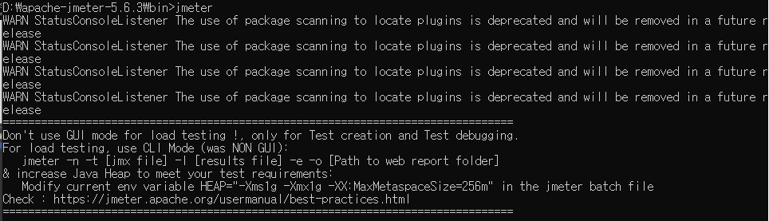
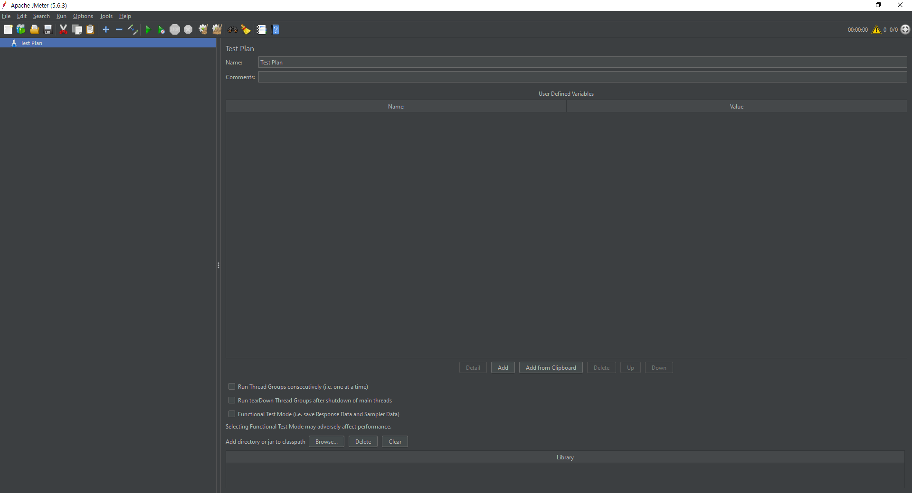
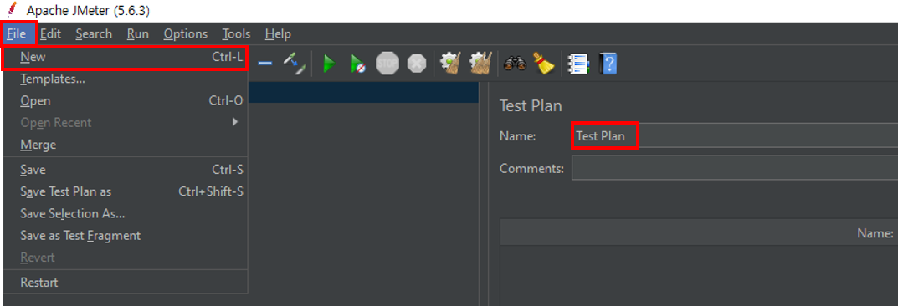
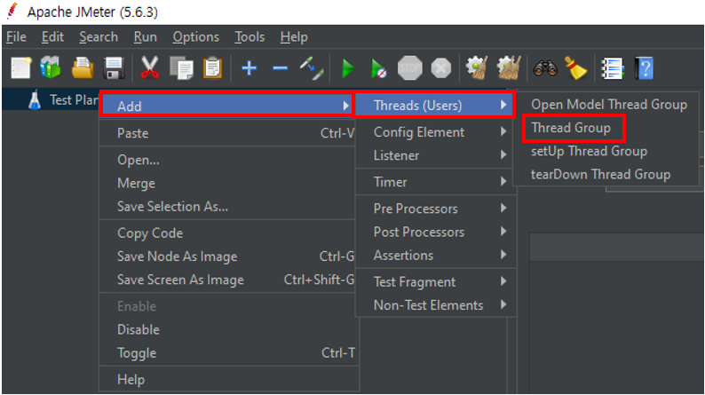
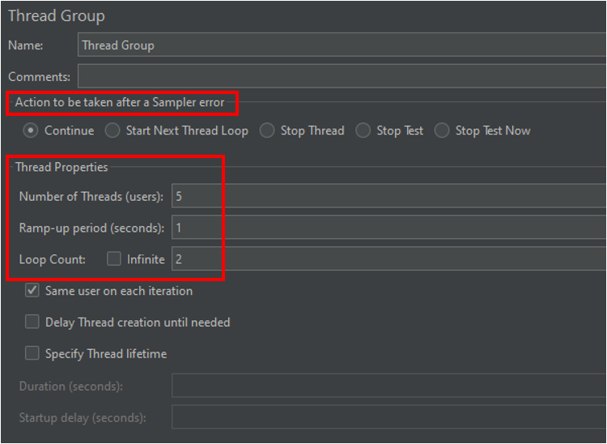
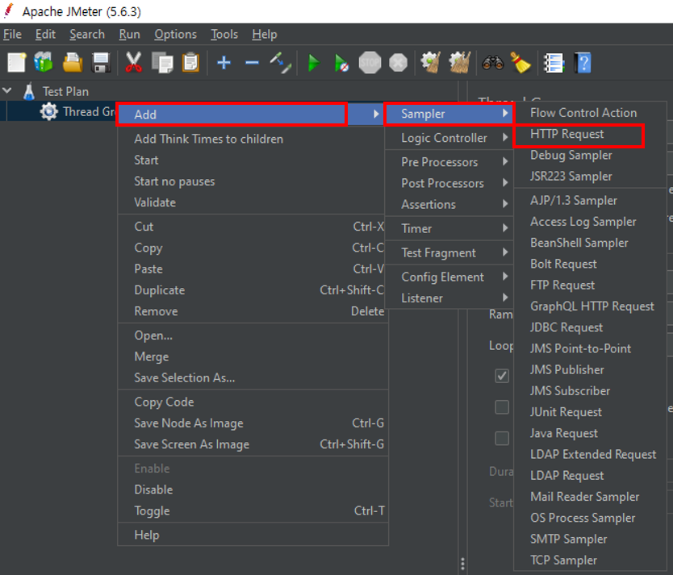
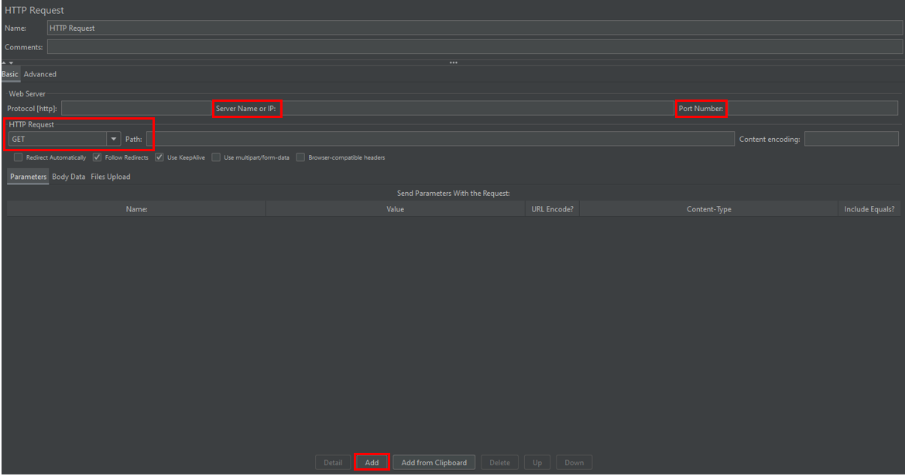

## JMeter란?
  

Apache JMeter는 웹 애플리케이션 및 다양한 프로토콜에 대해 부하 테스트와 성능 측정을 수행할 수 있는 오픈 소스 도구입니다. GUI 기반의 사용이 편리한 인터페이스를 제공하며, HTTP, HTTPS, FTP, JDBC, JMS, SOAP, REST 등 다양한 프로토콜을 지원한다. JMeter는 분산 테스트, 스크립트 기반 자동화, 확장 가능한 플러그인, 그리고 다양한 리포팅 및 분석 기능을 제공하여 웹 애플리케이션의 성능을 종합적으로 테스트할 수 있다.

## JMeter 실행 방법
cmd -> 압축푼 폴더 아래 bin 폴더로 이동 -> jmeter 실행
> ex) D:\apache-jmeter-5.6.3\bin

아래와 같은 GUI 가 나온다.

## JMeter 테스트

### JMeter 테스트 환경 유의사항
테스트 환경 분리해야한다. 실제 운영 환경과 테스트 환경을 분리하여 테스트 툴 JMeter와 테스트 대상 웹 어플리케이션이 사용하는 메모리 등 영향을 최소화 한다.

### JMeter 테스트 용어 정리
|항목|내용|
|-|-----|
|Thread Group|테스트에 사용될 쓰레드 개수, 쓰레드 1개당 사용자 1명
|Sampler|사용자의 액션 (예: 로그인, 게시물 작성, 게시물 조회 등)
|Listener|응답을 받아 리포팅, 검증, 그래프 등 다양한 처리
|Configuration|Sampler 또는 Listener가 사용할 설정 값 (쿠키, JDBC 커넥션 등)
|Assertion|응답 확인 방법 (응답 코드, 본문 내용 비교 등)

### 1. Test Plan 생성
File -> New -> Test Plan Name 설정

### 2. Thread Group
테스트 쓰레드, 쓰레드 개수를 만드는데 소요되는 시간, 요청 횟수를 설정한다.

방금 만든 테스트에 오른쪽 클릭 -> Add -> Threads (Users) -> Thread Group

 

#### Action to be taken after a Sampler error

Action to be taken after a Sampler error에서 Error가 리턴됐을 때 어떻게 할 건지에 대한 설정을 할 수 있다.

|항목|내용|
|-|-----|
|Continue|오류가 발생해도 JMeter는 현재 스레드 그룹의 다음 샘플러를 계속 실행. 오류는 로그에 기록되지만, 이후 샘플러의 실행에는 영향을 미치지 않음
|Start Next Thread Loop|오류가 발생하면 현재 스레드 루프를 중단하고, 스레드 그룹 내의 다음 루프 반복을 시작. 이는 루프 컨트롤러나 스레드 그룹의 루프 카운트를 기반
|Stop Thread|오류가 발생한 스레드만 중지. 이 옵션을 선택하면 해당 스레드의 모든 샘플러 실행이 중단
|Stop Test|오류가 발생하면 전체 테스트가 즉시 중지됩니다. 모든 스레드와 샘플러의 실행이 중단
|Stop Test Now|"Stop Test"와 유사하지만, 이 옵션은 테스트를 가능한 한 빨리 중지. 모든 현재 실행 중인 샘플러를 강제로 중단시키고 즉시 종료
|Abort Test|테스트 실행을 즉시 중단하고 JMeter를 종료합니다. 이는 긴급 상황에서 사용되며, 모든 스레드와 샘플러가 즉시 중단

#### Thread Properties

5명의 유저가 1초만에 2번 반복해서 에러가 발생해도 계속 요청을 보낸다고 설정

|항목|내용|
|-|-----|
|Number of Threads|테스트에 사용할 가상 사용자(쓰레드)의 수를 설정
|Ramp-up period|쓰레드 개수를 만드는데 소요되는 시간
|Loop Count| 각 스레드가 테스트 계획을 몇 번 반복할지를 설정

### 3. Sampler

Thread Groupd이 해야할 행동을 정의하는 샘플이다.

Thread Group 우클릭 -> Add -> Sampler -> HTTP Request 클릭

테스트로 통신을 시도한 Controller를 기준으로 기입

### 4. Listener
Sampler가 받아오는 리턴 값을 바탕으로 그래프, 레포팅을 만들어주는 Listener를 설정

### 5. Timers
JMeter의 테스트 플랜에 샘플러를 등록하면 순차적으로 진행이 되지만 현실 세계에서 하나의 사용자가 요청을 순차적으로 매우 빠른 시간내에 수행하는 것은 불가능하다. 이처럼 요청과 요청 사이에 특정한 시간 간격을 두려면 Timers를 이용해서 설정할 수 있다.
 
### 6. Assertion
JMeter의 HTTP 프로토콜을 이용해서 성능 테스트를 할 경우 요청별 성공/실패 여부는 HTTP 응답 코드의 값을 이용해서 판단한다. HTTP 응답 코드가 200이면 성공을, 그외에 다른 코드 값은 실패로 규약되어 있다. JMeter에서도 이를 그대로 사용하며 200번 코드가 리턴되면 테스트는 성공으로 인식한다.
하지만 업무적으로 200번 코드가 리턴되더라도 실패로 판단해야 하는 경우도 많이 있다. 이 경우 Assertion를 이용해서 응답 정보에 특정한 메시지를 필터링해서 성공/실패 여부를 판단할 수 있다.

### 7. Configuration Elements
Configuration Elements는 샘플러와 밀접한 관련이 있다. 비록 직접적으로 요청을 수해하지는 않지만 샘플러의 요청 정보를 관리할 수 있다. 예를 들어 테스트 플랜이 복잡해서 HTTP Request Sampler 작성을 많이 해야 하는데, 서버 IP나 포트 등 공통적으로 많이 사용되는 부분이 있다면 Configuration Elements의 "HTTP Request Defaults"에 설정하면 된다. 그러면 해당 설정 정보가 관련된 HTTP Request에 모두 적용된다.

### 8. Pre-Processor Elements
샘플러를 실행하기 전에 수행해야 할 내용을 정의한다. 예를 들어 요청을 하기 전에 파라미터 값을 초기화하는 등의 작업에 사용한다.

> 위 항목들은 JMeter 실행시 우선순위가 존재하는데, 다음과 같다.
Configuration -> Pre-Processor -> Timer -> Sampler -> Post-Processor -> Assertions -> Listener

## Test Scenario

10s 동안 IP에서 받을 수 있는 최대 콜수를 선택하기 위한 기준으로 
2500Thread, 3000Thread, 5000Thread, 10000Thread 총 4가지 경우로 테스트 진행했고,실제 운영 시 호출하는 콜수를 알 수 없기 때문에 임시로 서버 처리 성능 기준만으로 선정하여 테스트 실시했다.

## 테스트 진행간 Loop Count와 Thread Count 혼란
`시나리오 1 : number of thread 수가 10 인 경우 ramp-up 시간은 10이고 loop count는 1`

`시나리오 2 : number of thread 수가 1이면 ramp-up 시간은 1이고 loop count는 10`
두 시나리오의 차이점은 무엇이며 성능에 비슷한 영향을 끼칠까? 시나리오 2에서 요청 사이의 지연은 얼마일까?

시나리오 2에서 모든 스레드가 활성 상태로 유지될까?

스레드가 사용자를 시험하고 루프 카운트는 스레드가 요청을하는 횟수를 의미한다는 알고있다.

그럼 차이를 생각 해보면, 시나리오 1에서는 10 개의 스레드가 사용되고 ramp-up period은 10 초이므로 JMeter는 10 개의 스레드를 모두 기동하고 실행하는 데 10 초가 걸리게되고

각 스레드는 이전 스레드가 시작된 후 1 초 (10을 10으로 나눈 값)마다 시작된다.

​
30 개의 스레드가 있고 120 초의 램프 업 기간이있는 경우 각 연속 스레드는 4 초 지연된다.

시나리오 2에서 JMeter는 1 개의 스레드를 실행하고 하나의 스레드가 완료되면 다음 스레드가 시작되고 10 번 반복됩니다.

몇 가지 세부 사항을 명확히 해보자. 두 시나리오 모두에서 10 개의 스레드가 생성됩니다. 시나리오 2에서 새 스레드가 시작되면 이전 스레드가 살아 있을것이다.

이 둘의 차이점은 시나리오 1에서 스레드는 병렬로 작동 할 수 있으며 시나리오 2에서 각 스레드는 이전 스레드가 중지 된 후 시작됩니다. 그리고 지정하지 않는 한 스레드간에 지연이 없다.
​

따라서 결국 시나리오 2에서는 하나의 1 스레드 만 살아 있고 시나리오 1에서는 모든 스레드가 살아 있다.

## 참고

- https://www.redline13.com/blog/2019/05/jmeter-thread-count/
- https://12bme.tistory.com/503
- https://jmeter.apache.org/usermanual